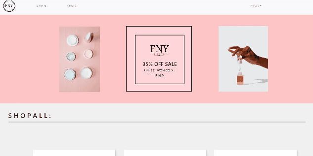
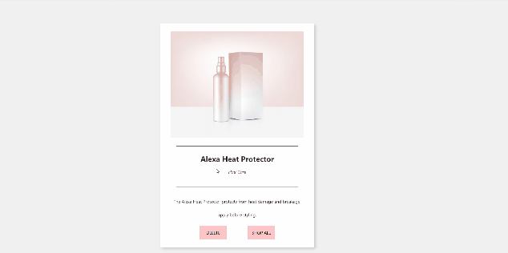
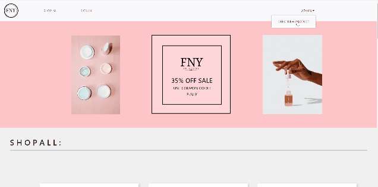

# _FNY - Fresh New You!_

#### _A react app created as a mock site for a skincare company. latest update 07//2020_

#### By _**Mai C.**_


## Components Diagram

<!-- [] -->







## Description

_This app was created as a mock e commerce site for a fake skincare company called FNY_

## Project Specifications

| Behavior | Input | Output |
|---|---|---|
|a user can see an item|a user clicks an item|details list shows up for item |
|a user can see a list of items for sale|a user clicks shop now| a user sees all items|
| a vendor has access to full crud funtionality | a vendor signs in |all views and buttons for CRUD functionality show|
|a user can only see details and list of items |  |   |

## Setup/Installation Requirements

_In Terminal:_

* Navigate to where you want this application to be saved, i.e.:
```cd desktop```
* Clone the file from GitHub with HTTPS
```git clone https://github.com/LonleyBuzzyBee/FNY.git```
*  ```FNY```
* Open file in your preferred text editor
* run  ```npm install```
* then ```npm build```
* finally ```npm start```


## Known Bugs

_No known bugs at this time._

## Support and contact details

_Have a bug or an issue with this application? [Open a new issue](https://github.com/LonleyBuzzyBee/FNY/issues) here on GitHub._

## Technologies Used

_React with Redux_
_Javascript_
_CSS_
_Webpack_
_Firebase_

### License

[MIT](https://choosealicense.com/licenses/mit/)

Copyright (c) 2020 **_Mai C._**